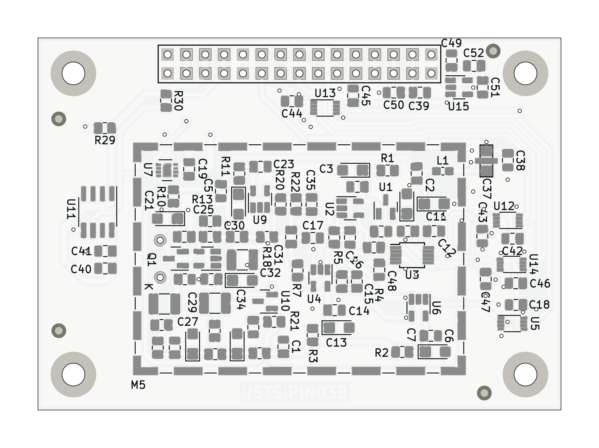

## USTSIPIN03 - Semiconductor based ionizing radiation dosimeter and spectrometer analog front-end

The USTSIPIN03 is developed as single board improved variant of the [PIND02](https://github.com/mlab-modules/PIND02) and [PCRD07](https://github.com/mlab-modules/PCRD07) modules from [MLAB.cz development system](https://www.mlab.cz/).  The analog front end is core part of the [AIRDOS04 cosmic radiation detector and dosimeter](https://github.com/UniversalScientificTechnologies/AIRDOS04). 

